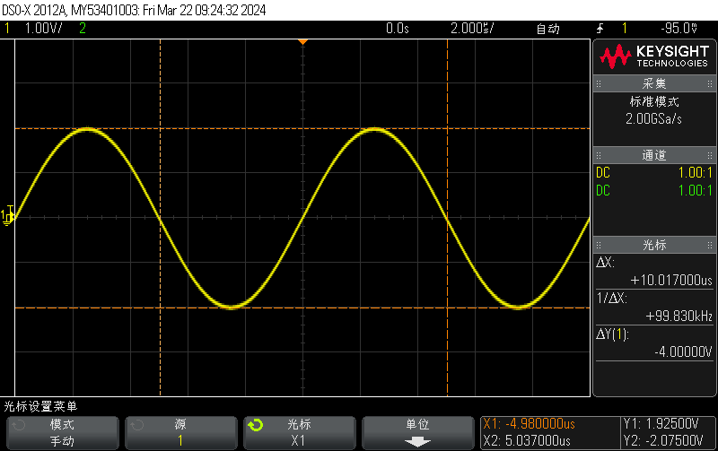
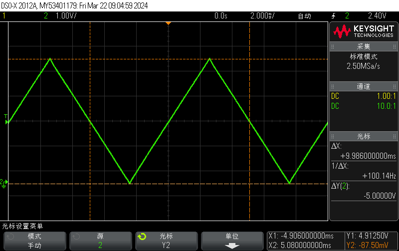
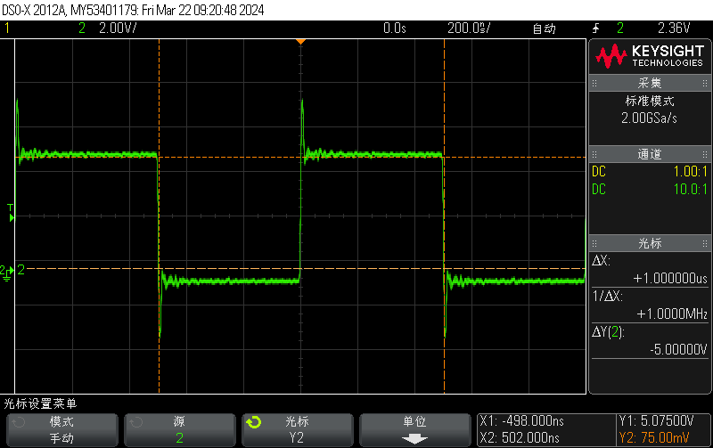

# 实验一：示波器实验 - 实验报告

## 波形图

### 正弦波

### 方波

### 三角波

### 时钟模块

## 波形的测量频率，低电平，高电平值

### 正弦波

- 测量频率：$99.830\;\mathrm{kHz}$
- 低电平值：$-2.07500\;\mathrm{V}$
- 高电平值：$1.92500\;\mathrm{V}$

### 方波

- 测量频率：$1.0000\;\mathrm{MHz}$
- 低电平值：$-462.50\;\mathrm{mV}$
- 高电平值：$5.33750\;\mathrm{V}$

### 三角波

- 测量频率：$100.14\;\mathrm{Hz}$
- 低电平值：$-87.50\;\mathrm{mV}$
- 高电平值：$4.91250\;\mathrm{V}$

### 时钟模块

- 测量频率：$1.0000\;\mathrm{MHz}$
- 低电平值：$75.00\;\mathrm{mV}$
- 高电平值：$5.07500\;\mathrm{V}$
