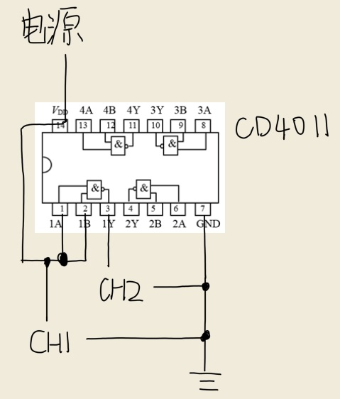
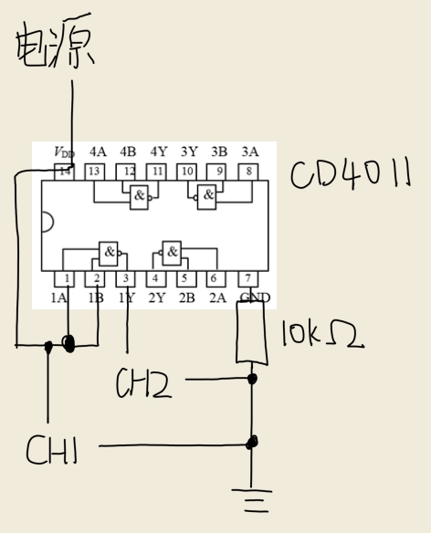
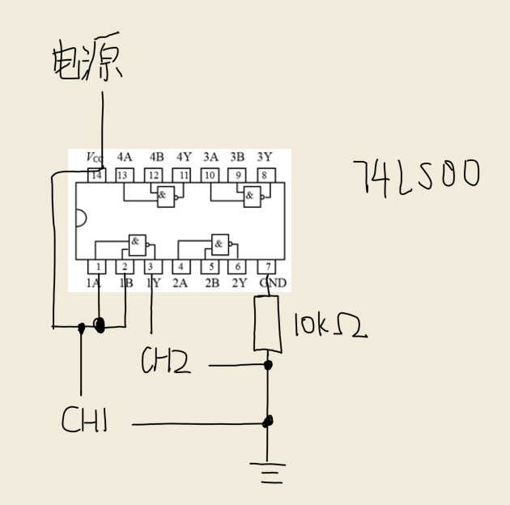
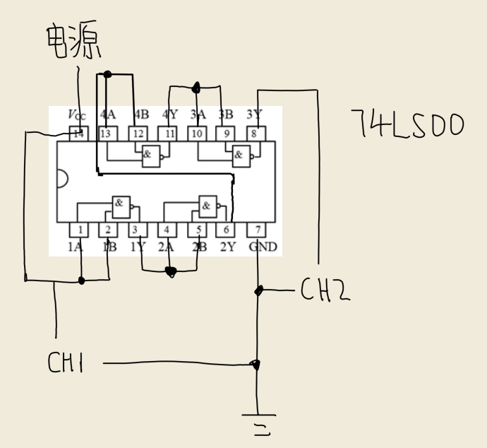
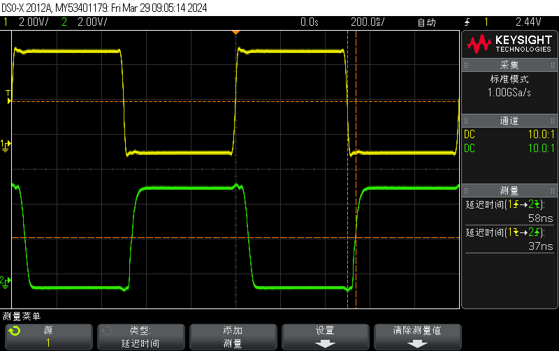
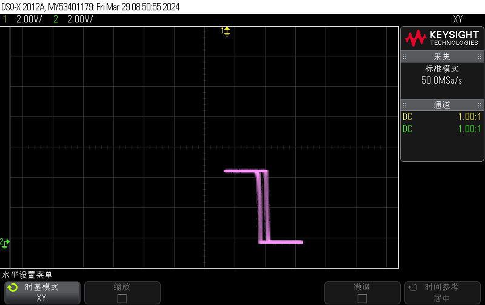
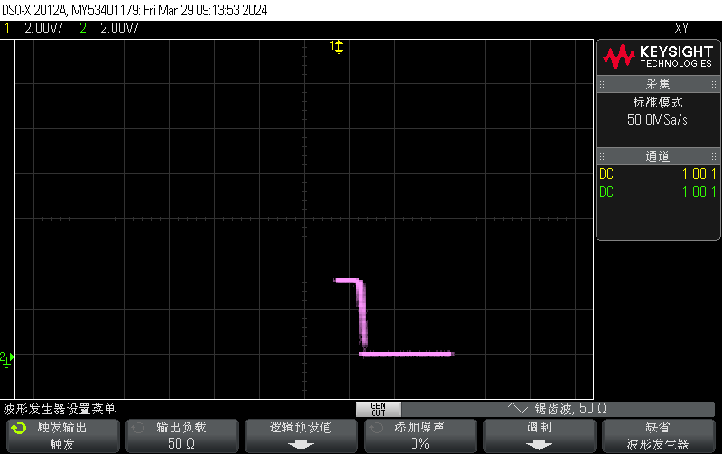
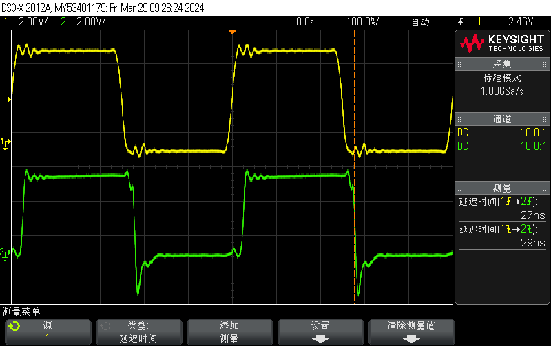

# 实验 2 示波器实验 - 实验报告

## 实验电路图

### CD4011 平均延迟时间

### CD4011 电压传输特性

### 74LS00 电压传输特性

### 74LS00 平均延迟时间

## 波形图与实验数据

### CD4011 平均延迟时间

#### 波形图

#### 实验数据

由图得 $t_{pHL} = 58\;\mathrm{ns}, t_{pLH} = 37\;\mathrm{ns}$，则
$$
t_{pd} = \dfrac{t_{pHL} + t_{LH}}{2} = 47.5\;\mathrm{ns}.
$$

### CD4011 电压传输特性

#### 波形图

### 74LS00 电压传输特性

#### 波形图

### 74LS00 平均延迟时间

#### 波形图

#### 实验数据

由图得 $t_{pd1} = 27\;\mathrm{ns}, t_{pd2} = 29\;\mathrm{ns}$，则
$$
t_{pd} = \dfrac{1}{4}\cdot \dfrac{t_{pd1} + t_{pd2}}{2} = 7\;\mathrm{ns}.
$$

## 比较 TTL 与非门 74LS00 和 CMOS 与非门 CD4011 的性能

通过实验数据，比较二者的平均延迟时间，得
$$
t_{pd, \text{TTL}} = 7\;\mathrm{ns} < 47.5\;\mathrm{ns} = t_{pd, \text{CMOS}}.
$$
由此可知，使用 CMOS 工艺技术制作而成的与非门，通常比使用 TTL 工艺技术制作而成的与非门，拥有更高的工作速度。