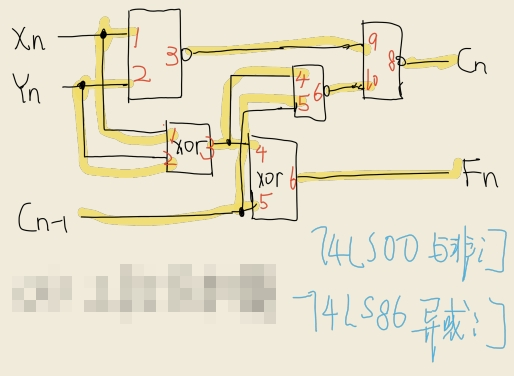
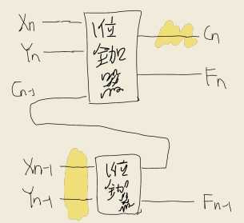
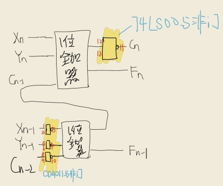
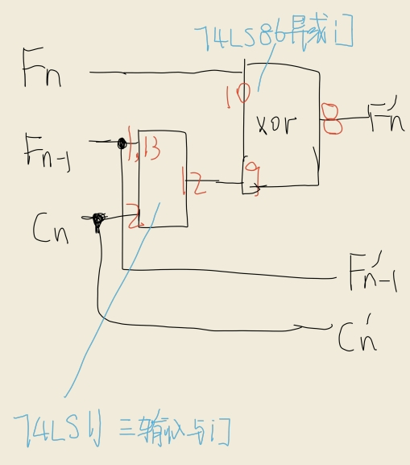
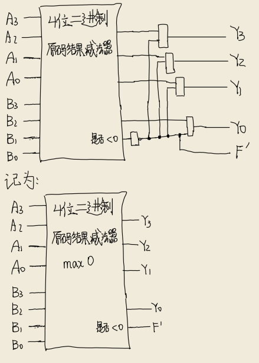
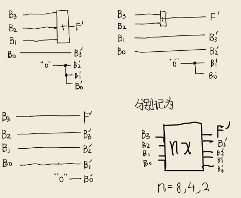
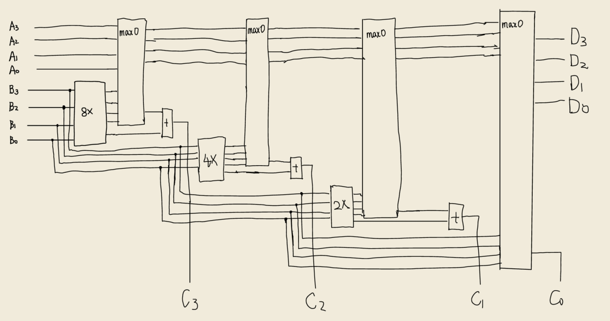

# 实验三：简单组合逻辑电路实验 - 实验报告

## 实验数据

### 1 位全加器

功能表如下：

$$
\begin{align*}
F_n & = A_n \oplus B_n \oplus C_{n-1}, \\
C_n & = \overline {\overline{A_n \cdot B_n} \cdot \overline{C_{n-1} \cdot (A_n \oplus B_n)}}.
\end{align*}
$$

逻辑图如下：

### 2 位全加器

两个 1 位全加器级联后的逻辑图如下：

### 补码结果减法器

修改 2 位全加器之后的逻辑图如下：

### 原码结果减法器

补码翻译为原码的译码器的功能表如下：

| 十进制 | $C_n$ | $F_n$ | $F_{n-1}$ | $C_n'$ | $F_n'$ | $F_{n-1}$ |
| :----: | :---: | :---: | :-------: | :----: | :----: | :-------: |
|  $-3$  |  $1$  |  $0$  |    $1$    |  $1$   |  $1$   |    $1$    |
|  $-2$  |  $1$  |  $1$  |    $0$    |  $1$   |  $1$   |    $0$    |
|  $-1$  |  $1$  |  $1$  |    $1$    |  $1$   |  $0$   |    $1$    |
|  $0$   |  $0$  |  $0$  |    $0$    |  $0$   |  $0$   |    $0$    |
|  $1$   |  $0$  |  $0$  |    $1$    |  $0$   |  $0$   |    $1$    |
|  $2$   |  $0$  |  $1$  |    $0$    |  $0$   |  $1$   |    $0$    |
|  $3$   |  $0$  |  $1$  |    $1$    |  $0$   |  $1$   |    $1$    |

表达式如下：
$$
\begin{align*}
C_n' & = C_n, \\
F_{n}' & = (C_n \cdot F_{n-1}) \oplus F_n, \\
F_{n-1}' & = F_{n-1}.
\end{align*}
$$
逻辑图如下：

最终实物图如下：

## 加/减法运算电路的设计方法

加/减法运算电路的设计总结为四个步骤：

1. 绘制该电路的功能表
2. 用卡诺图或其他方法对表达式进行化简
3. 绘制接线图

其中，第二步是最重要也是最需要技巧的。有的时候仅通过**与非门**和**异或门**会使电路变得更加方便；有的时候，则需要对目标函数进行额外的化简——使用**与门**是否会使接线变得更加简洁？使用**或非门**呢？——这都是需要考虑的。

## 遇到的故障、问题以及解决办法

- 数码管数字显示不正确
  - 原因：数码管的 $2, 4, 8$​ 插线孔均未接地。
  - 解决办法：将其接地。
- 14 脚器件模块个数不够
  - 原因：为了方便接线，没有使用与非门的所有引脚。
  - 解决办法：使用 16 脚器件模块代替 14 脚器件模块。

## 设计四位二进制除法运算电路

给定一个 4 位二进制原码结果减法器，我们很容易设计一个 4 位二进制减法 `max0` 器件，返回两个数的差和 $0$ 的较大值，用 $F'$ 表示原结果是否为负。

给定 $B$，我们也很容易得到 $8B, 4B, 2B, B$ 的位表示，用 $F'$ 表示结果是否大于 $15$。

最终的运算电路如下：

