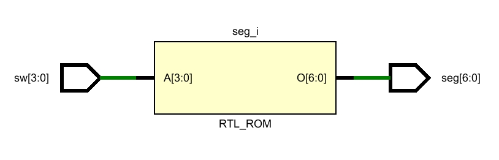

# 实验四：点亮数码管实验 - 实验报告

## 工作原理



```systemverilog
module decoder (
    // 数组 [r:l] 表示 a[r], a[r - 1], ..., a[l]
    // [x:0] 比 [0:x] 更普遍
    // 多维数组可以写为 [r2:l2][r1:l1]
    input wire [3:0] sw,    // 输入：开关
    output reg [6:0] seg    // 输出：七段数码管
    );

    // 适用于组合逻辑电路的 always 语句，重复执行
    always_comb begin
        case (sw)
            // sw 看作是 4 位 16 进制的值 0~F
            // seg 分别被赋值为 7 位 2 进制的值，对应译码器的功能表
            4'h0: seg = 7'b1111110;
            4'h1: seg = 7'b0110000;
            4'h2: seg = 7'b1101101;
            4'h3: seg = 7'b1111001;
            4'h4: seg = 7'b0110011;
            4'h5: seg = 7'b1011011;
            4'h6: seg = 7'b1011111;
            4'h7: seg = 7'b1110000;
            4'h8: seg = 7'b1111111;
            4'h9: seg = 7'b1110011;
            4'hA: seg = 7'b1110111;
            4'hB: seg = 7'b0011111;
            4'hC: seg = 7'b1001110;
            4'hD: seg = 7'b0111101;
            4'hE: seg = 7'b1001111;
            4'hF: seg = 7'b1000111;
            default: seg = 7'b0; // 其余情况则不显示
        endcase
    end
endmodule
```

## 总结

- **问题**：我在编写完程序，连接好烧写线，将程序烧进 FPGA 后，发现数码 `3` 这个不能正确显示。经过测试，我发现是 `3` 的右侧下方的数码管没有点亮。
- **解决办法**：我怀疑是 `4'h3: seg = 7'b1111001;` 这句话写错了。再次**检查功能表和代码**后，我发现我将 `7'b1111001` 写成了 `7b'1101001`，数码管 c 位置上的数值有误。
- **总结**：功能表和代码间一定要多次检查是否相同；如果发现某个数码管的行为不正常，则有可能是对应位置的数码管的代码有误。
