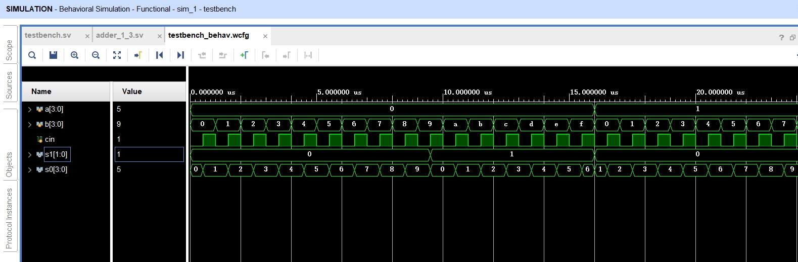

# 实验 5 四位全加器实验 - 实验报告

## 工作原理

### 基础部分 + 提高要求 3

将四个 1 位全加器串联起来，前一级输出的 $C_{n-1}$ 作为后一级输入的 $C_{n-1}$，即可得到 4 位串行进位加法器。

```systemverilog
module full_adder(A, B , Cin, F, Cout);
    input wire A, B, Cin;
    output wire F, Cout;

    assign F = A ^ B ^ Cin;
    assign Cout = (A & B) | (Cin & (A ^ B));
endmodule

module adder (
    input wire[3:0] A,
    input wire[3:0] B,
    input wire Cin,
    output wire [3:0] seg0,    // 输出：七段数码管低位
    output wire [1:0] seg1     // 输出：七段数码管高位
);

    wire[2:0] C;	// 进位
    wire[4:0] F;	// 输出结果

    full_adder adder0 (
        .A(A[0]),
        .B(B[0]),
        .Cin(Cin),
        .F(F[0]),
        .Cout(C[0])
    );

    full_adder adder1 (
        .A(A[1]),
        .B(B[1]),
        .Cin(C[0]),
        .F(F[1]),
        .Cout(C[1])
    );

    full_adder adder2 (
        .A(A[2]),
        .B(B[2]),
        .Cin(C[1]),
        .F(F[2]),
        .Cout(C[2])
    );

    full_adder adder3 (
        .A(A[3]),
        .B(B[3]),
        .Cin(C[2]),
        .F(F[3]),
        .Cout(F[4])
    );
    
    // 至此，F[4:0] 表示一个 [0, 31] 的整数
    // seg1 为高位 [0, 3]，seg0 为低位 [0, 9]
    
    assign seg1 = F / 10;
    assign seg0 = F % 10;

endmodule
```

### 提高要求 1 + 提高要求 3

并行加法器（超前进位加法器）各位的进位不是由前一级全加器的进位输出来提供的，而是由**专门的进位门**来提供的。

引入进位传递函数 $P_i$ 和进位产生函数 $G_i$ 如下：

$$
\begin{cases}
P_i = X_i + Y_i, \\
G_i = X_iY_i.
\end{cases}
$$

则各位进位可以被表示为：

$$
\begin{align*}
C_1 & = G_1 + P_1C_0, \\
C_2 & = G_2 + P_2G_1 + P_2P_1C_0, \\
C_3 & = G_3 + P_3G_2 + P_3P_2G_1 + P_3P_2P_1C_0, \\
C_4 & = G_4 + P_4G_3 + P_4P_3G_2 + P_4P_3P_2G_1 + P_4P_3P_2P_1C_0.
\end{align*}
$$

```systemverilog
// 设计实现超前进位的四位加法器，将结果采用十进制表示，并使用自带译码的七段数码管显示结果

module PG(Xi, Yi, Pi, Gi);
    input wire Xi, Yi;
    output wire Pi, Gi;

    assign Pi = Xi | Yi;
    assign Gi = Xi & Yi;
endmodule

module adder_1_3 (
    input wire[3:0] A,
    input wire[3:0] B,
    input wire Cin,
    output reg [3:0] seg0,    // 输出：七段数码管低位
    output reg [1:0] seg1     // 输出：七段数码管高位
    );

    wire[3:0] P;    // 进位传递函数
    wire[3:0] G;    // 进位生成函数
    
    PG pg0 (.Xi(A[0]), .Yi(B[0]), .Pi(P[0]), .Gi(G[0]));
    PG pg1 (.Xi(A[1]), .Yi(B[1]), .Pi(P[1]), .Gi(G[1]));
    PG pg2 (.Xi(A[2]), .Yi(B[2]), .Pi(P[2]), .Gi(G[2]));
    PG pg3 (.Xi(A[3]), .Yi(B[3]), .Pi(P[3]), .Gi(G[3]));
    
    wire[2:0] C;	// 进位
    wire[4:0] F;	// 输出结果
    
    assign C[0] = G[0] | (P[0] & Cin);
    assign C[1] = G[1] | (P[1] & G[0]) | (P[1] & P[0] & Cin);
    assign C[2] = G[2] | (P[2] & G[1]) | (P[2] & P[1] & G[0]) | (P[2] & P[1] & P[0] & Cin);
    assign F[4] = G[3] | (P[3] & G[2]) | (P[3] & P[2] & G[1]) | (P[3] & P[2] & P[1] & G[0]) | (P[3] & P[2] & P[1] & P[0] & Cin);
    
    assign F[0] = A[0] ^ B[0] ^ Cin;
    assign F[1] = A[1] ^ B[1] ^ C[0];
    assign F[2] = A[2] ^ B[2] ^ C[1];
    assign F[3] = A[3] ^ B[3] ^ C[2];
    
    // 至此，F[4:0] 表示一个 [0, 31] 的整数
    // seg1 为高位 [0, 3]，seg0 为低位 [0, 9]
    
    assign seg1 = F / 10;
    assign seg0 = F % 10;
    
endmodule
```

### 提高要求 2 + 提高要求 3

```systemverilog
// 使用 SystemVerilog 自带的加法运算实现四位全加器，将结果采用十进制表示，并使用自带译码的七段数码管显示结果

module adder_2 (
    input wire[3:0] A,
    input wire[3:0] B,
    input wire Cin,
    output wire[3:0] seg0,    // 输出：七段数码管低位
    output wire[1:0] seg1     // 输出：七段数码管高位
);

    wire[4:0] F;
    assign F = {1'b0, A} + {1'b0, B} + Cin;
    
    // 至此，F[4:0] 表示一个 [0, 31] 的整数
    // seg1 为高位 [0, 3]，seg0 为低位 [0, 9]
    
    assign seg1 = F / 10;
    assign seg0 = F % 10;

endmodule
```

## 软件仿真

对所有可能的输入 $(a, b, \text{cin})$ 进行检查。

```systemverilog
`timescale 1ns / 1ps
module testbench;

reg[3:0] a;
reg[3:0] b;
reg cin;
wire[3:0] s0;    // 输出：七段数码管低位
wire[1:0] s1;    // 输出：七段数码管高位

initial begin
    for (integer i = 0; i < 16; i++) begin
        for (integer j = 0; j < 16; j++) begin
            for (integer k = 0; k < 2; k++) begin
                a = i;
                b = j;
                cin = k;
                #500;
            end
        end
    end
end

adder_1_3 a13 (.A(a), .B(b), .Cin(cin), .seg0(s0), .seg1(s1));

endmodule
```

仿真得到的图形如下：



可以看出，当 $a \in \{0,1, \cdots 15\}, b \in \{0, 1, \cdots, 15\}, \text{cin} \in \{0, 1\}$ 时，$a + b + \text{cin}$ 分别取值为

$$
0, 1, 1, 2, \cdots, 15, 16/ 1, 2, 2, 3, \cdots, 16, 17/ \cdots/ 15, 16, 16, 17, \cdots, 30, 31.
$$

由图知 $\text{s}_1$ 为 $a + b + \text{cin}$ 的十位，$s_0$ 为 $a + b + \text{cin}$ 的个位。

## 功能测试

实际上测试得到的电路功能和仿真相同。输入为 `A`、`B`、`Cin`，计算得 `A + B + Cin` 的十位为 `seg1`，个位为 `seg0`。

## 总结

- **问题**：仿真时，我发现 `s1` 和 `s0` 的值都是 `X`。上网查找相关资料后，发现这是因为 `s1` 和 `s0` 未定义导致的。那么究竟是在哪里出现了问题，导致它们未定义的呢？
- **解决办法**：通过检查，发现在 module `adder_1_3` 里定义的 `wire[4:0] F;` 写成了 `wire[5:0] F;`。这导致 `seg1` 和 `seg0` 在进行除法的时候位数不对。
- **总结**：
  - 我意识到，在仿真时需要仔细检查代码，即使是一个小的定义错误，也可能导致未定义结果。
  - 同时，我觉得位宽的匹配非常重要，在写 SystemVerilog 的时候，应该要确保信号和变量的位宽正确匹配，以避免位数不对的问题。
