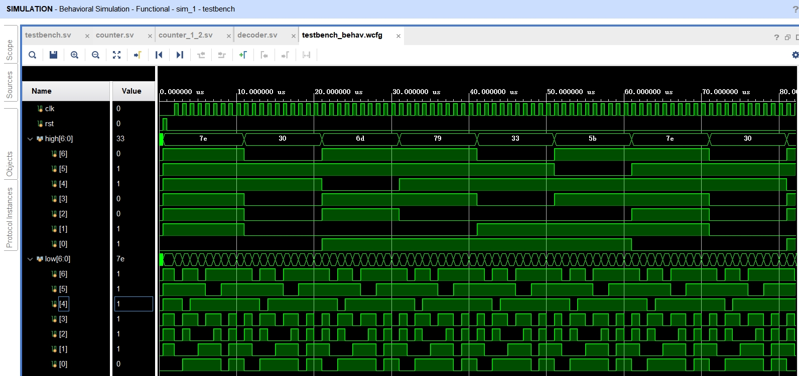

# 实验六：计数器实验 - 实验报告

## 工作原理

### 基础部分

在每个 CLK 的上升沿，首先 `cnt_L` 会自增 $1$。

如果 `cnt_L` 等于 $9$，则说明需要进位，此时 `cnt_H` 会自增 $1$ ，同时 `cnt_L` 会清零。

如果 `cnt_H` 等于 $5$，则说明计数已经到达最大值，此时两个计数器都会清零，重新从 $0$ 开始计数。

这样就实现了一个 $0 \sim 59$ 的计数器。

```systemverilog
module counter (
    input wire CLK,             // 计数开关
    input wire RST,             // 复位开关
    output reg [6:0] High,      // 高位数码管输出
    output reg [6:0] Low        // 低位数码管输出
    );

    reg [3:0] cnt_H;
    reg [3:0] cnt_L;

    always_ff @(posedge CLK or posedge RST) begin
        if (RST) begin // 按下复位开关，清零
            cnt_H <= 0;
            cnt_L <= 0;
        end else begin
            cnt_L <= cnt_L + 1;
            if (cnt_L == 9) begin // 低位到高位的进位
                cnt_H <= cnt_H + 1;
                cnt_L <= 0;
                if (cnt_H == 5) begin // 溢出清零
                    cnt_H <= 0;
                end
            end
        end
    end

    decoder u1 (
        .sw(cnt_H),
        .seg(High)
    );

    decoder u2 (
        .sw(cnt_L),
        .seg(Low)
    );

endmodule
```

### 提高要求 1 + 提高要求 2

添加 `Switch` 作为启动/暂停的开关，只有当 `Switch` 为真时才进行计数。

由于时钟模块上的 `1M` 时钟的频率为 $1\;\mathrm{MHz}$，故需要将其转换为 $1\;\mathrm{Hz}$；添加 `cnt_total` 来完成这个任务，只有其达到 $999999$ 时才使 `cnt_L` 加 $1$。

```systemverilog
// 使用时钟模块上的 1M 时钟，将计数器改成秒表；使用开关模块上的拨动开关控制秒表启动/暂停

module counter_1_2 (
    input wire CLK,             // 计数开关
    input wire RST,             // 复位开关
    input wire Switch,          // 启动/暂停开关
    output reg [6:0] High,      // 高位数码管输出
    output reg [6:0] Low        // 低位数码管输出
    );

    reg [3:0] cnt_H;
    reg [3:0] cnt_L;
    reg [30:0] cnt_total;

    always_ff @(posedge CLK or posedge RST) begin
        if (RST) begin // 按下复位开关，清零
            cnt_H <= 0;
            cnt_L <= 0;
            cnt_total <= 0;
        end else if (Switch) begin // 如果启动
            cnt_total <= cnt_total + 1;
            if (cnt_total == 999999) begin // 1MHz -> 1Hz 的计数转换
                cnt_L <= cnt_L + 1;
                cnt_total <= 0;
                if (cnt_L == 9) begin // 低位到高位的进位
                    cnt_H <= cnt_H + 1;
                    cnt_L <= 0;
                    if (cnt_H == 5) begin // 溢出清零
                        cnt_H <= 0;
                    end
                end
            end
        end
    end

    decoder u1 (
        .sw(cnt_H),
        .seg(High)
    );

    decoder u2 (
        .sw(cnt_L),
        .seg(Low)
    );
endmodule
```

## 软件仿真

对所有可能的输入 $(a, b, \text{cin})$ 进行检查。

```systemverilog
`timescale 1ns / 1ps
module testbench;

reg clk;
reg rst;
reg[6:0] high;          // 输出：数码管高位
reg[6:0] low;           // 输出：数码管低位

initial begin
    clk = 0;
    rst = 0;
    #500
    rst = 1;            // 给一个上升沿清零
    #500
    rst = 0;            // RST 重新为 0
    #500
    for (integer i = 0; i < 200; i++) begin
        #500 clk = ~clk;
    end
end

counter c (.CLK(clk), .RST(rst), .High(high), .Low(low));

endmodule
```

仿真得到的图形如下：



| 数值 |    译码管     |
| :--: | :-----------: |
| $0$  | $\mathrm{7e}$ |
| $1$  | $\mathrm{30}$ |
| $2$  | $\mathrm{6d}$ |
| $3$  | $\mathrm{79}$ |
| $4$  | $\mathrm{33}$ |
| $5$  | $\mathrm{5b}$ |
| $6$  | $\mathrm{5f}$ |
| $7$  | $\mathrm{70}$ |
| $8$  | $\mathrm{7f}$ |
| $9$  | $\mathrm{73}$ |

可以看出 `high` 在 `low` 每更新 $10$ 次就会加 $1$，且在到 $5$（即 $\mathrm{5b}$）之后会重置为 $0$（即 $\mathrm{7e}$）。

## 功能测试

实际上测试得到的电路功能和仿真相同。在基础部分的功能测试中，可以满足按下时钟模块上的复位开关 `CLK` 时显示数据加 $1$，且到 $59$ 时复位为 $0$；也能够按下复位开关 `RST` 作为复位输入。

## 总结

- **问题**：仿真时，我发现 `high` 和 `low` 的值都是 `00`。这意味着 `cnt_H` 和 `cnt_L` 均为 `X`，即未定义。那么究竟是在哪里出现了问题，导致它们未定义的呢？
- **解决办法**：通过检查，我发现只有在 `if (RST)` 这一个分句中执行了两个清零操作，`cnt_H` 和 `cnt_L` 才能够有初始值，否则就会是未定义。因此我在仿真时先使 RST 有一个上升沿，这样就能够正确初始化 `cnt_H` 和 `cnt_L` 均为 $0$，而非未定义。
- **总结**：
  - 在仿真时需要仔细检查代码，即使是一个小的定义错误，也可能导致未定义结果。
  - 在计数之前，一定要保证变量有初始值。
