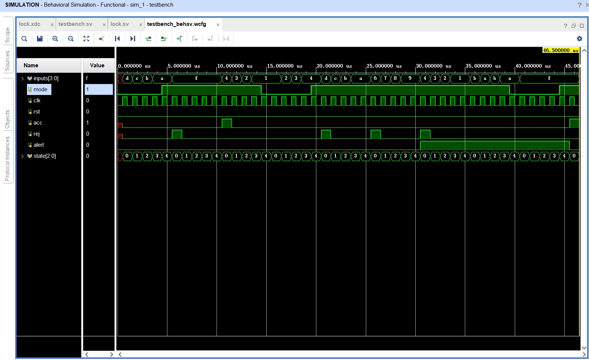

# 实验 7 计数器实验 - 实验报告

## 工作原理

### 基础部分 + 提高要求 1 + 提高要求 2

- 加入了 $\text{FFFF}$ 作为管理员密码。

  直接在密码锁没有被锁定时，判断语句中添加一个“或”语句即可。

- 添加了系统报警功能。在代码中，用 `cnt` 来表示输入错误次数，同时用 `always_comb` 组合逻辑来得到 `alert` 并输出。

  在密码锁被锁定的时候，不能修改密码、不能用普通用户的密码进行解锁；此时只能输入管理员密码来开锁。

```systemverilog
module lock(
    input wire[3:0] inputs,
    input wire mode,
    input wire CLK,
    input wire RST,
    output reg acc,
    output reg rej,
    output reg alert,
    output reg[2:0] state
);

    parameter[15:0] root_pwd = 16'hFFFF;
    reg[15:0] pwd = root_pwd;
    reg[15:0] token;
    reg[2:0] next_state;
    reg[2:0] cnt;
    
    always_ff @(posedge CLK or posedge RST) begin
        if (RST) begin
            state <= 0;
            acc = 0;
            rej = 0;
        end else begin
            case (state)
                0: token[3:0] <= inputs;
                1: token[7:4] <= inputs;
                2: token[11:8] <= inputs;
                3: token[15:12] <= inputs;
                default: ;
            endcase
            state <= next_state;
            
            if (state == 4) begin
                if (mode) begin // 如果是验证
                    if (!alert) begin // 密码锁没有被锁定
                        if (token == pwd || token == root_pwd) begin
                            acc = 1;
                            rej = 0;
                            cnt = 0;
                        end else begin // 密码错误
                            acc = 0;
                            rej = 1;
                            cnt = cnt + 1;
                        end
                    end else begin // 密码锁被锁定
                        if (token == root_pwd) begin
                            acc = 1;
                            rej = 0;
                            cnt = 0;
                        end else begin
                            acc = 0;
                            rej = 0;
                        end
                    end
                end else begin // 如果是设置
                    if (!alert) begin // 密码锁没有被锁定
                        pwd = token;
                    end
                end
            end else begin
                acc = 0;
                rej = 0;
            end
        end
    end
    
    always_comb begin
        case (state)
            0: next_state <= 1;
            1: next_state <= 2;
            2: next_state <= 3;
            3: next_state <= 4;
            4: next_state <= 0;
            default: next_state <= 0;
        endcase
    end
    
    always_comb begin
        if (cnt >= 3)
            alert <= 1;
        else
            alert <= 0;
    end

endmodule
```

## 软件仿真

我模拟了一次使用密码锁的过程，具体过程如以下代码所示：

```systemverilog
`timescale 1ns / 1ps
module testbench;

reg[3:0] inputs;
reg mode;
reg clk, rst;
reg acc, rej;
reg alert;
reg [2:0] state;

task clock_cycle;
    begin
        clk = 1;
        #500;
        clk = 0;
        #500;
    end
endtask

task try_input;
    input [15:0] test_value;
    integer i;
    begin
        for (i = 0; i < 4; i = i + 1) begin
            inputs = test_value[i*4 +: 4];
            clock_cycle;
        end
    end
    mode = 1;
    clock_cycle; // 确认输入
endtask

task change_password;
    input [15:0] test_value;
    integer i;
    begin
        for (i = 0; i < 4; i = i + 1) begin
            inputs = test_value[i*4 +: 4];
            clock_cycle;
        end
    end
    mode = 0;
    clock_cycle; // 确认输入
endtask

initial begin
    // 初始化
    clk = 0;
    rst = 0;
    mode = 0;
    #500;
    // 管理员密码: FFFF, 密码: FFFF（初始为管理员密码）
    
    // 验证
    try_input(16'hABCD); // 第一次尝试 ABCD
    try_input(16'hFFFF); // 第二次正确输入 FFFF
    
    // 修改
    change_password(16'h1234); // 修改密码为 1234
    
    // 验证
    try_input(16'h4321); // 第一次尝试 4321
    try_input(16'hABCD); // 第二次尝试 ABCD
    try_input(16'h9876); // 第三次尝试 9876
    try_input(16'h1234); // 尝试用密码 1234 解封
    
    // 修改
    change_password(16'hABAB); // 尝试修改密码为 ABAB
    
    // 验证
    try_input(16'hFFFF); // 尝试用管理员密码 FFFF 解封
    clock_cycle;
    
end

lock lk (.inputs(inputs), .mode(mode), .CLK(clk), .RST(rst), .acc(acc), .rej(rej), .alert(alert), .state(state));

endmodule
```

仿真得到的图形如下：



观察 `acc`、`rej` 和 `alert` 的波形，可以发现分别对应于：

|                动作                 | `acc`、`rej` 和 `alert` 波形的变化 |
| :---------------------------------: | :--------------------------------: |
|      第一次尝试 $\text{ABCD}$       |            `rej` 为 $1$            |
|    第二次正确输入 $\text{FFFF}$     |            `acc` 为 $1$            |
|          修改密码为 $1234$          |                 -                  |
|          第一次尝试 $4321$          |            `rej` 为 $1$            |
|      第二次尝试 $\text{ABCD}$       |            `rej` 为 $1$            |
|      第三次尝试 $\text{9876}$       |    `rej` 为 $1$，`alert` 为 $1$    |
|       尝试用密码 $1234$ 解封        |         `alert` 仍然为 $1$         |
|    尝试修改密码为 $\text{ABAB}$     |         `alert` 仍然为 $1$         |
| 尝试用管理员密码 $\text{FFFF}$ 解封 |    `acc` 为 $1$，`alert` 为 $0$    |

这说明仿真验证该电路能够正常运行。

## 功能测试

实际上测试得到的电路功能和仿真相同。密码锁在实际测试中，可以通过模式开关来决定密码锁是设置密码还是验证密码。由密码输入开关输入密码，复位按键可以随时清空已有输入。

## 总结

- **问题**：

  1. 在综合时，Vivado 报错

     ```
     [Synth 8-87] always_comb on 'acc_reg' did not result in combinational logic ["E:/Codes/Projects/Digital-Logic-Experimentation/lab7/lock/lock.srcs/sources_1/new/lock.sv":56]
     [Synth 8-327] inferring latch for variable 'acc_reg' ["E:/Codes/Projects/Digital-Logic-Experimentation/lab7/lock/lock.srcs/sources_1/new/lock.sv":56]
     ```

     该怎么解决？
  2. 在仿真时，有很多过程是重复的，如何避免重复多次写同样或是形似的代码？

- **解决办法**：

  1. 这是因为代码错误，导致产生了锁存器。解决办法可以是穷尽 `always_comb` 块中的所有寄存器的赋值语句。或者是将所有 `always_comb` 里的代码移植到 `always_ff` 里。

  2. 可以定义函数来解决这个问题。SystemVerilog 中的函数定义类似如下：

     ```systemverilog
     task change_password;
         input [15:0] test_value; // 函数输入
         integer i;
         begin
             for (i = 0; i < 4; i = i + 1) begin
                 inputs = test_value[i*4 +: 4];
                 clock_cycle;
             end
         end
         mode = 0;
         clock_cycle;
     endtask
     ```

- **总结**：
  - 在仿真时需要仔细检查代码，即使是一个小的定义错误，也可能导致未定义结果。
  - 可以使用函数来提升代码复用率。
